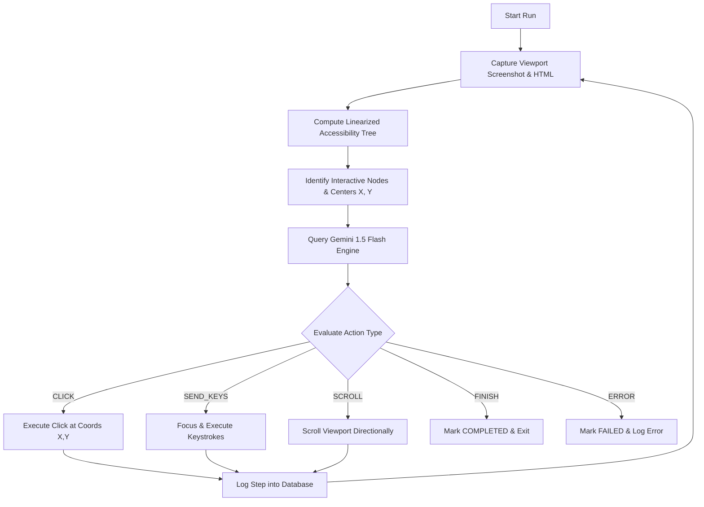

# System Architecture & Design

This document details the design and execution lifecycle of the Antigravity Autonomous Web Agent.

---

## 🔁 The Sense-Think-Act Loop

The agent runs a continuous, stateful execution loop guided by user-specified instructions:

### 1. Sense (Observe)
Instead of consuming raw, nested HTML structures, the agent translates the page into a **Linearized Accessibility Tree**. This tree contains only element roles, names, statuses, and center-point coordinates.

### 2. Think (Decide)
The linearized representation is bundled with instructions and the latest viewport snapshot and sent to **Gemini 1.5 Flash**. The LLM evaluates the state and outputs a structured choice of action along with its strategic thought.

### 3. Act (Execute)
Using **Playwright**, the agent acts on the physical coordinate space of the page rather than finding dynamic CSS selectors. This coordinate-based interaction is highly robust to layout variations and CSS class renames.

---

## 📊 Logging & Persistence
Every step is tracked transactionally inside the PostgreSQL database:
- `agent_runs` monitors overall execution duration, instruction intent, and final status (`COMPLETED`, `FAILED`).
- `action_logs` captures step index, action types, LLM thoughts, coordinate parameters, and base64/S3 screenshot URLs.
